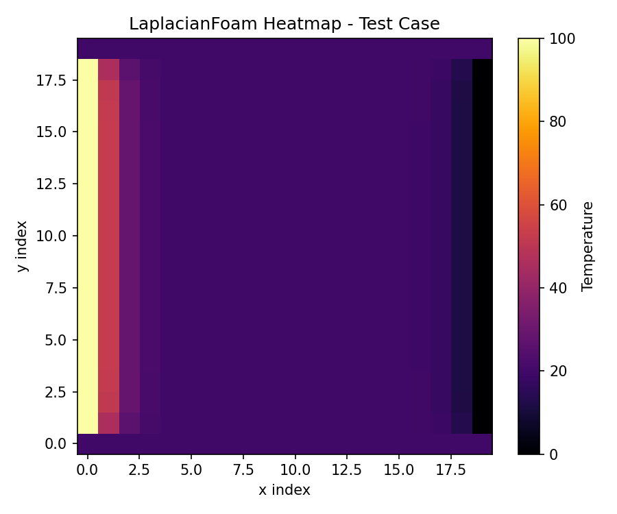

# Test Case Report

## Case Summary
- Solver: laplacianFoam
- Mesh: 20 x 20 x 1, structured
- Domain: [1.0, 1.0, 1.0] meters
- Initial fields: U=[0,0,0], p=101325 Pa, T=20 °C
- Boundary conditions:
  - left: dirichlet = 100.0
  - right: dirichlet = 0.0
  - top: dirichlet = 20.0
  - bottom: dirichlet = 20.0
- Simulation: max_iters=200, dt=0.001, tolerance=1e-6

## Simulation Results
- Converged: True
- Iterations: 199
- Residuals (last 5): [0.08937264422211655, 0.08893886793387651, 0.08850811979945661, 0.08808037415359848, 0.08765560557591101]
- Heatmap min: 0.0
- Heatmap max: 100.0
- Heatmap mean: 24.132879204747756

## Heatmap Image

